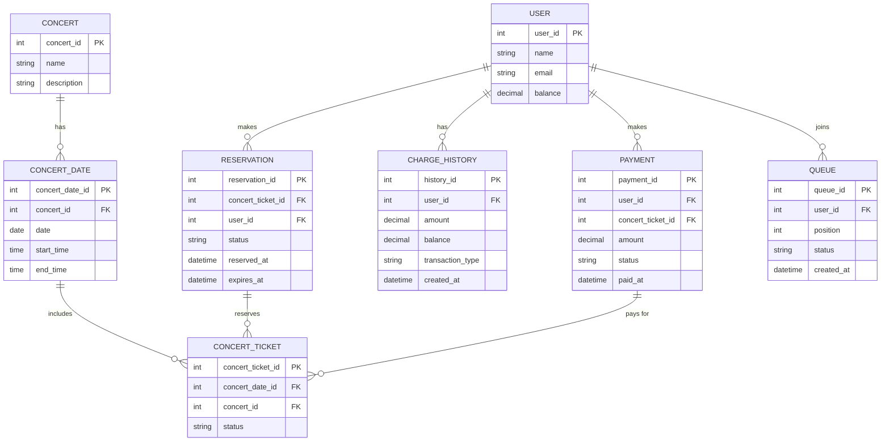

# 🎟️ 콘서트 예약 서비스

## 📘 Description

콘서트 예약 서비스는 사용자가 대기열 시스템을 통해 예약 가능한 좌석을 확인하고 예약할 수 있는 서비스를 제공합니다.  
동시성 문제를 해결하며, 다수의 애플리케이션 인스턴스 환경에서도 안정적으로 동작할 수 있도록 구현되었습니다.

---

# 🛠 Features

<details>
<summary>주요 기능</summary>
<br>

1. **유저 토큰 발급 API**  
   - 유저의 UUID와 대기열 관리 정보를 포함하는 토큰 발급.  
   - 발급된 토큰을 이용해 대기열 검증 후 서비스 이용 가능.  
   - 대기열 정보로 대기 순서 또는 잔여 시간이 제공됩니다.  

2. **예약 가능 날짜 / 좌석 조회 API**  
   - 예약 가능한 날짜 목록 조회.  
   - 특정 날짜에 예약 가능한 좌석 정보를 조회.  

3. **좌석 예약 요청 API**  
   - 좌석 예약과 동시에 해당 좌석은 임시로 5분 동안 배정.  
   - 배정 시간 내 결제가 완료되지 않으면 임시 배정 해제.  
   - 동시성 이슈를 고려하여 안정적인 예약 처리.  

4. **잔액 충전 및 조회 API**  
   - 사용자가 예약 시 사용할 잔액 충전.  
   - 사용자 식별자로 현재 잔액 조회.  

5. **결제 API**  
   - 결제 처리 및 결제 내역 생성.  
   - 결제가 완료되면 좌석 소유권을 유저에게 배정.  
   - 대기열 토큰 만료 처리.  
<br>
</details>

---

# 🚀 Requirements

<details>
<summary>요구사항</summary>
<br>

- **5가지 주요 API 구현**
  - 유저 토큰 발급 API
  - 예약 가능 날짜 / 좌석 조회 API
  - 좌석 예약 요청 API
  - 잔액 충전 및 조회 API
  - 결제 API
- **단위 테스트**: 각 기능 및 제약사항에 대해 최소 1개 이상의 단위 테스트 작성.
- **다수 인스턴스 지원**: 다수의 애플리케이션 인스턴스에서도 기능 정상 작동.
- **동시성 문제 해결**: 동시 요청 처리 안정성 보장.
- **대기열 시스템**: 유저 대기열 관리 및 검증.
<br>
</details>

---

# 🏗 모듈 설계

<details>
<summary>모듈 설계</summary>

### 1. **콘서트 모듈 (ConcertModule)**

- **설명**: 콘서트와 관련된 모든 기능을 관리하는 핵심 도메인 모듈입니다. 하위 모듈로 `예약`과 `결제`를 포함하며, 두 모듈은 콘서트 도메인에 종속적입니다.
    - 콘서트 약 날짜/좌석 조회 요청 처리.
---

### 2. **예약 모듈 (ReservationModule)**

- **설명**: 좌석 예약 요청을 처리하는 모듈입니다.
- **주요 기능**:
  - 좌석 예약 요청 처리.
  - 예약 시 좌석을 5분 동안 임시 배정.
  - 임시 배정 해제 로직 포함.
---

### 3. **결제 모듈 (PaymentModule)**

 - **설명**: 좌석 결제 및 결제 내역 생성을 처리하는 모듈입니다.
- **주요 기능**:
  - 좌석 결제 및 결제 내역 생성.
  - 좌석 소유권 배정 처리.
  - 결제 완료 후 대기열 토큰 만료 처리.
---

### 4. **유저 모듈 (UserModule)**

- **설명**: 사용자 정보와 잔액 관리를 담당합니다. 사용자의 신원을 확인하고, 예약 및 결제 시 필요한 잔액을 관리합니다.
- **하위 모듈**:
  - **BalanceModule**:
    - 사용자의 잔액 충전 및 조회 기능 제공.
    - 충전 금액 유효성 검증.

---

### 5. **대기열 모듈 (QueueModule)**

- **설명**: 서비스 이용을 위한 대기열 관리 및 검증을 담당합니다.
- **주요 기능**:
  - 유저 토큰 발급.
  - 대기열 상태 관리 (대기 순서, 잔여 시간).
  - 대기열 검증을 통해 API 접근 제어.

<br>
</details>

---

# 🔄 모듈 간 의존성 및 데이터 흐름
<details>
<summary>모듈 간 의존성</summary>
<br>

1. **콘서트 모듈 ↔ 대기열 모듈**  
    - 대기열 토큰을 통해 유저가 유효한 대기열 상태인지 확인.  
    - 유효한 유저만 예약 요청 및 결제 가능.  

2. **유저 모듈 ↔ 콘서트 모듈**  
    - 예약 및 결제 과정에서 사용자 잔액 검증 및 업데이트.  

3. **대기열 모듈 ↔ 유저 모듈**  
    - 유저 정보를 기반으로 대기열 상태 관리.  

4. **예약 모듈 ↔ 결제 모듈**  
    - 예약 완료 후 결제 요청 처리.  
    - 결제 완료 시 예약 상태 업데이트.  
<br>
</details>

---

# 🎟️ 콘서트 모듈 - 폴더 구조(클린 아키텍처 사용)


<details>
<summary>모듈 구조</summary>

```plaintext
src/
└── concert/                     # 콘서트 관련 모듈
    ├── application/             # Application Layer
    │   ├── usecases/            # 유스케이스
    │   │   ├── CreateConcertUseCase.ts
    ├── domain/                  # Domain Layer
    │   ├── models/              # 도메인 엔티티 및 값 객체
    │   │   ├── Concert.ts
    │   │   └── ConcertDate.ts
    │   ├── repositories/        # Repository 인터페이스
    │   │   └── ConcertRepositoryInterface.ts
    │   ├── services/            # 도메인 서비스
    │   │   └── ConcertDomainService.ts
    ├── infrastructure/                   # Infrastructure Layer
    │   ├── repositories/        # Repository 구현체
    │   │   └── ConcertRepository.ts
    ├── presentation/            # Presentation Layer
    │   ├── controllers/         # REST API 컨트롤러
    │   │   └── ConcertController.ts
    │   └── dto/                 # 요청/응답 DTO
    │       ├── ConcertRequestDto.ts
    │       └── ConcertResponseDto.ts
    └── common/                  # 공통 로직
        ├── filters/             # 예외 필터
        │   └── ConcertExceptionFilter.ts
        ├── guards/              # 인증 및 권한 관리
        │   └── ConcertGuard.ts
        ├── utils/               # 유틸리티 함수
        │    └── ConcertUtils.ts
        ├── pipes/               # 요청 검증 파이프
        │   └── ValidateConcertPipe.ts
        └── interceptors/        # 응답 변환 인터셉터
            └── loggingIntercepter.ts
```
</details>

---

# 🎟️ 콘서트 예약 시스템 - 시퀀스 다이어그램

<details>
<summary>시퀀스 다이어그램</summary>

  ## 1. 유저 토큰 발급
  <details>
  <summary>1. 유저 토큰 발급 API</summary>

  ```mermaid
  sequenceDiagram
      participant User as 사용자
      participant Queue as 대기열
      participant DB as 데이터베이스

      User->>Queue: 토큰 발급 요청
      Queue->>DB: 사용자 정보 확인
      DB-->>Queue: 사용자 상태 반환
      Queue-->>User: 토큰 반환
  ```
  </details>

  ## 2. 예약 가능 날짜 / 좌석 조회
  <details>
  <summary>2. 예약 가능 날짜 / 좌석 조회 API</summary>

  ```mermaid
  sequenceDiagram
      participant User as 사용자
      participant Concert as 콘서트
      participant DB as 데이터베이스

      User->>Concert: 예약 가능한 날짜 조회 요청
      Concert->>DB: 예약 가능한 날짜 목록 조회
      DB-->>Concert: 날짜 목록 반환
      Concert-->>User: 날짜 목록 반환
  ```
  </details>

  ## 3. 좌석 예약 요청
  <details>
  <summary>3. 좌석 예약 요청 API</summary>

  ```mermaid
  sequenceDiagram
      participant User as 사용자
      participant Concert as 콘서트
      participant Queue as 대기열
      participant DB as 데이터베이스

      User->>Concert: 좌석 예약 요청
      Concert->>Queue: 대기열 상태 확인
      Queue-->>Concert: 대기열 유효성 확인
      Concert->>DB: 좌석 상태 확인 및 임시 예약
      DB-->>Concert: 임시 예약 성공
      Concert-->>User: 예약 성공 응답
  ```
  </details>

  ## 4. 잔액 충전 및 조회
  <details>
  <summary>4. 잔액 충전 및 조회 API</summary>

  ```mermaid
  sequenceDiagram
      participant User as 사용자
      participant Account as 잔액 관리
      participant DB as 데이터베이스

      User->>Account: 잔액 충전 요청
      Account->>DB: 잔액 업데이트
      DB-->>Account: 충전 결과 반환
      Account-->>User: 충전 성공 응답

      User->>Account: 잔액 조회 요청
      Account->>DB: 사용자 잔액 조회
      DB-->>Account: 잔액 정보 반환
      Account-->>User: 잔액 정보 반환
  ```
  </details>

  ## 5. 결제
  <details>
  <summary>5. 결제 API</summary>

  ```mermaid
  sequenceDiagram
      participant User as 사용자
      participant Payment as 결제
      participant Concert as 콘서트
      participant DB as 데이터베이스

      User->>Payment: 결제 요청
      Payment->>Concert: 좌석 상태 확인
      Concert->>DB: 좌석 예약 상태 확인
      DB-->>Concert: 좌석 예약 상태 반환
      Concert-->>Payment: 예약 상태 확인 완료
      Payment->>DB: 결제 정보 저장
      DB-->>Payment: 저장 완료
      Payment-->>User: 결제 성공 응답
  ```
  </details>
  <br>
</details>

---

# 🔄 ERD

<details>
<summary>ERD</summary>
<br>


</detail>